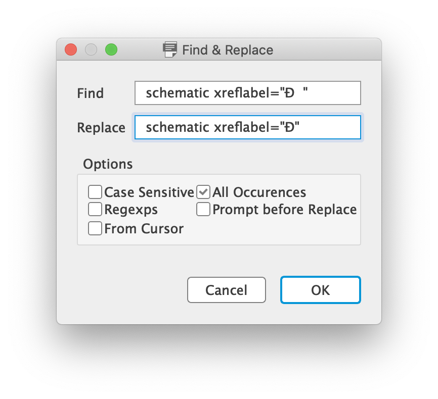

### Arduino-Nano-V3-Reference

These Eagle project files were downloaded from [arduino.cc](https://arduino.cc) and had been modified. The original ```.sch``` file is incompatible with newer version of Eagle. Text replacement is needed for upward compatible.

- Download this [zip](https://content.arduino.cc/assets/Nano-reference.zip) and unzip.
- Open Eagle, then "Open"->"Text..." to select NanoV3.3.sch file from the unzipped folder.
- Saving after "find-and-replace".



Tested on Eagle 9.6.2.

Credit to [ktnewcom](https://community.element14.com/members/ktnewcom) from [element14 forum](https://community.element14.com/products/devtools/technicallibrary/w/documents/14215/arduino-nano-3-0-reference-design-eagle-files).